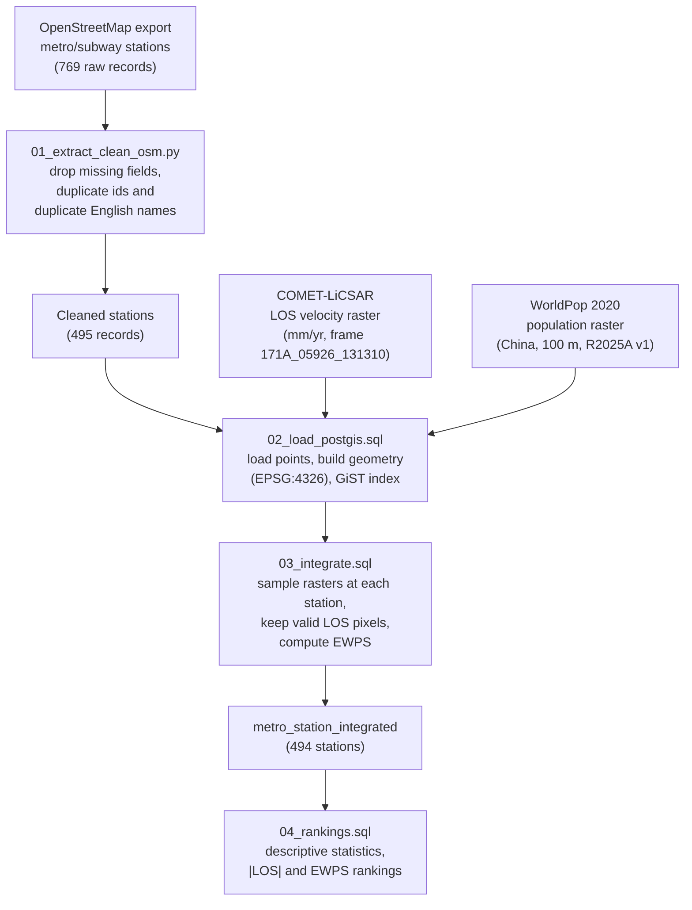

# Spatial ETL workflow

Reproducible extract–transform–load (ETL) pipeline that integrates Shanghai
metro station locations, COMET-LiCSAR line-of-sight (LOS) deformation velocity
and WorldPop 2020 residential population into a single queryable PostGIS table.

The scripts reconstruct the processing behind the published results from the
data products stored in this repository. Running them on the source layers
reproduces the 494 integrated stations and the statistics and rankings reported
in the paper (Tables 2–4).

## Workflow



## Steps

| Step | Script | Purpose |
|------|--------|---------|
| 1 | `01_extract_clean_osm.py` | Clean the raw OSM export: remove records with missing required fields, duplicate OSM ids and duplicate English station names. 769 → 495 records. |
| 2 | `02_load_postgis.sql` | Create the PostGIS schema, load the cleaned stations as WGS 84 points, and register the LOS and population rasters. |
| 3 | `03_integrate.sql` | Representative spatial query: sample both rasters at each station, retain only stations on a valid LOS pixel (495 → 494), and compute `EWPS = |v_LOS| * log10(population + 1)`. |
| 4 | `04_rankings.sql` | Retrieve the descriptive statistics (Table 2) and the two rankings compared in the study (Tables 3–4). |

## Data provenance

| Dataset | Source | Variable (unit) | Resolution | Reference period | Version / Frame | CRS |
|---------|--------|-----------------|-----------|------------------|-----------------|-----|
| Metro stations | OpenStreetMap | Station location | Vector (point) | Retrieved Jan 2026 | – | EPSG:4326 |
| Deformation | COMET-LiCSAR (Sentinel-1) | LOS velocity (mm yr⁻¹) | ~100 m | Sentinel-1 observations | Frame 171A_05926_131310, ascending | EPSG:4326 |
| Population | WorldPop | Residential population (persons per cell) | 100 m | 2020 | Release R2025A v1 (China) | EPSG:4326 |

Negative LOS velocity denotes motion away from the satellite and is consistent
with subsidence. All 494 integrated stations fell on valid velocity pixels, so
no gap-filling of deformation values was required.

## Running

```bash
# Step 1: clean the OSM export
python3 01_extract_clean_osm.py \
    --input ../shanghai_metro_stations_raw.csv \
    --output ../shanghai_metro_stations_fixed.csv

# Steps 2-4: load and integrate in PostGIS (requires the PostGIS extension)
psql -d shanghai -f 02_load_postgis.sql
psql -d shanghai -f 03_integrate.sql
psql -d shanghai -f 04_rankings.sql
```
